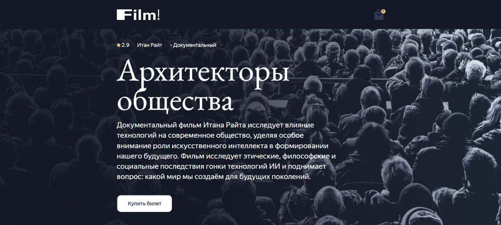

# Film! — Сервис бронирования билетов в кинотеатр

Бэкенд для онлайн-сервиса бронирования билетов. Управление фильмами, расписанием сеансов и бронированием мест. REST API на Nest.js с хранением данных в MongoDB.

<p align="center">
  
</p>

## Технологии

- Nest.js (контроллеры, сервисы, модули, DTO)
- TypeScript
- MongoDB, Mongoose (схемы, поддокументы)
- REST API (OpenAPI-спецификация)
- Раздача статического контента
- React (фронтенд — в заготовке)

## Установка и запуск

### MongoDB

Установите MongoDB с [официального сайта](https://www.mongodb.com/) или через пакетный менеджер вашей ОС.

### Бэкенд

```bash
cd backend
npm ci
```

Создайте `.env` из `.env.example`:

```env
DATABASE_DRIVER="mongodb"
DATABASE_URL="mongodb://localhost:27017/prac"
DEBUG=*
```

Запуск:

```bash
npm run start:debug
```

### Фронтенд

```bash
npm run dev
```

## API

| Метод | Роут | Описание |
|-------|------|----------|
| GET | `/api/afisha/films/` | Список всех фильмов |
| GET | `/api/afisha/films/:id/schedule` | Фильм с расписанием сеансов |
| POST | `/api/afisha/order` | Бронирование билетов |
| GET | `/content/afisha/*` | Статический контент (афиши) |
